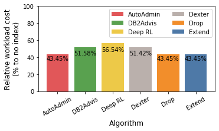

# Deep Reinforcement Learning for Indexes

With this small experiment we want to compare traditional index selection approaches with a deep reinforcement learning based approach. The experiment is based on the [source code](https://github.com/Bensk1/autoindex/tree/index_selection_evaluation) for the paper [The Case for Automatic Database Administration using Deep Reinforcement Learning](https://arxiv.org/abs/1801.05643). We explicitly thank the authors for their cooperation and for providing the source code.

The experiment is conducted on the lineitem table of a TPCH standard data set with a scaling factor of 10. The utilized queries were generated by the source code provided by the authors of the original paper. Since their model does currently only support filter operations and no joins and other operations, we did not use any other queries for evaluation.

## Adaptions

### Infrastrucutre

We adapted the original source code slightly to enable a fair comparison with the implemented index selection approaches. Now, the cost estimations are not based on actual indexes but on HypoPG's hypothetical indexes. In addition, we implemented a cost cache to facilitate faster experiments.

### Index Selection Problem

We changed the initial problem size. For example, we increased the number of queries and columns in queries. See the following commits for further details: 
[8fcad5b](https://github.com/Bensk1/autoindex/commit/8fcad5b8ac08637213bd7ceb9ff7fc22ab7578f3), [183b8ec](https://github.com/Bensk1/autoindex/commit/183b8ec07571a2bfd723d79970a7414ab47d0309), [560db37](https://github.com/Bensk1/autoindex/commit/560db372c207deed0b7a71f914224c184c536ab7).

#### Queries

The resulting queries were the following.

```
"select count(*) from lineitem where l_partkey < 100000 and l_tax = 0.0 and l_extendedprice < 1000 and l_shipinstruct = 'NONE';"
"select count(*) from lineitem where l_shipdate < '1993-01-01' and l_receiptdate < '1992-06-29' and l_discount = 0.01 and l_returnflag = 'A' and l_shipmode = 'MAIL';"
"select count(*) from lineitem where l_discount = 0.0 and l_commitdate < '1996-01-01';"
"select count(*) from lineitem where l_discount = 0.02 and l_shipdate < '1993-01-01' and l_partkey < 1000;"
"select count(*) from lineitem where l_partkey < 1000 and l_linestatus = 'F' and l_shipmode = 'SHIP';"
"select count(*) from lineitem where l_quantity = 2 and l_suppkey < 100 and l_commitdate < '1992-04-15' and l_shipmode = 'AIR';"
"select count(*) from lineitem where l_shipinstruct = 'NONE';"
"select count(*) from lineitem where l_shipinstruct = 'COLLECT COD' and l_receiptdate < '1992-06-29';"
"select count(*) from lineitem where l_orderkey < 10000 and l_partkey < 1000000 and l_linenumber = 2 and l_returnflag = 'A' and l_linestatus = 'O';"
"select count(*) from lineitem where l_orderkey < 25000 and l_extendedprice < 1000 and l_commitdate < '1996-01-01' and l_linenumber = 3 and l_shipinstruct = 'DELIVER IN PERSON';"
```

### Model

We also adapted the model's hyperparameters to reflect for the new problem size. We obtained the new [configuration](https://github.com/Bensk1/autoindex/commit/560db372c207deed0b7a71f914224c184c536ab7) by try and error.

## Results

The final model weights for the aforementioned queries were exported and stored in `model_weights.h5`. The following solution was identified by the model:

```
Original Cost Estimate: 12369876.740000002, Optimized Cost Estimate: 6925730.29
['l_extendedprice', 'l_partkey', 'l_returnflag', 'l_suppkey']
```

These indexes are manually passed into the evaluation via the [DeepReinforcementAlgorithm](https://github.com/hyrise/index_selection_evaluation/blob/bensk1/deep_reinforcement_learning/selection/selection_algorithm.py).

Even though the traditonal approaches outperform the reinforcement approach in the examined case, the results are promising, given that the model does not rely on any manually implemented index selection logic, but learned to select these indexes.

